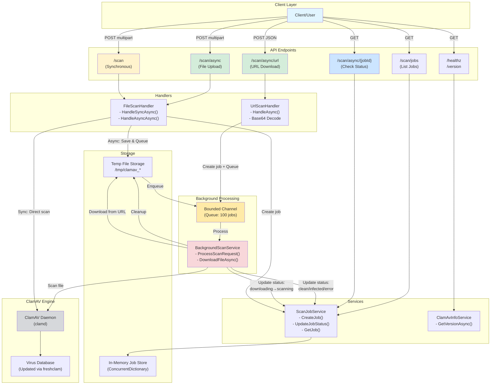

# 🛡️ GovUK DfE ClamAV API Container

A self-contained Dockerised antivirus scanning service built on **ClamAV** with a lightweight **.NET 8 HTTP API** and **Swagger UI**.

This container runs the ClamAV engine and exposes a simple REST API for uploading and scanning files.  
It’s designed for local development, testing, and service integration — all without needing to install ClamAV manually.

---

## 🚀 Features

- 🧩 **All-in-one container** – ClamAV + REST API + Swagger.
- 🔐 **Azure AD Authentication** – Secured with OAuth 2.0 client credentials flow.
- 🔄 **Automatic virus database updates** at start-up.
- 🧠 **Swagger UI** for easy manual testing (`/swagger`) with OAuth2 support.
- 💬 **Endpoints** for scanning, health checks, and ClamAV version info.
- ⚡ **Async scanning support** – Upload large files and poll for results (ideal for files >10MB).
- 🌐 **URL scanning** – Download and scan files from URLs with Base64 support.
- 🎯 **Performance optimized** – Tuned ClamAV settings + 4 concurrent workers for parallel processing.
- 💾 **Persistent database volume** so virus definitions are reused between restarts.
- 🔒 **Stateless HTTP interface** – ideal for CI pipelines or microservices.

---

## 🏗️ Architecture Diagram



### Flow Descriptions

**Synchronous Scan Flow:**
1. Client uploads file to `/scan`
2. API immediately scans with ClamAV
3. Returns result (clean/infected/error)

**Asynchronous File Upload Flow:**
1. Client uploads file to `/scan/async`
2. File saved to temp storage
3. Job created with "queued" status
4. Job ID returned immediately
5. Background service picks up job
6. Status: queued → scanning → clean/infected/error
7. Client polls `/scan/async/{jobId}` for status

**Asynchronous URL Download Flow:**
1. Client sends URL (optional Base64) to `/scan/async/url`
2. Job created with "downloading" status
3. Job ID returned immediately
4. Background service downloads file
5. Status: downloading → scanning → clean/infected/error
6. Client polls `/scan/async/{jobId}` for status

---

## 📁 Project Structure

```
.
├── Dockerfile                          # Builds .NET API + installs ClamAV
├── docker-compose.yml                  # Runs the container locally
├── scripts/
│   └── start.sh                        # Starts ClamAV & the API
├── conf/
│   ├── clamd.conf                      # ClamAV daemon configuration
│   └── freshclam.conf                  # Freshclam configuration
└── src/
    └── GovUK.Dfe.ClamAV/               # .NET 8 API project
        ├── Program.cs                  # Application entry point & DI configuration
        ├── Endpoints/                  # Endpoint route definitions
        │   ├── HealthEndpoints.cs      # Health check & version endpoints
        │   └── ScanEndpoints.cs        # All scan-related endpoints
        ├── Handlers/                   # Business logic handlers
        │   ├── FileScanHandler.cs      # Handles file upload scans
        │   └── UrlScanHandler.cs       # Handles URL download scans
        ├── Services/                   # Background & domain services
        │   ├── BackgroundScanService.cs    # Background job processor
        │   ├── ScanJobService.cs           # Job tracking & management
        │   └── ClamAvInfoService.cs        # ClamAV version info
        └── Models/                     # Data models
            ├── ScanJob.cs              # Job tracking model
            └── ScanUrlRequest.cs       # URL scan request model
```

---

## 🧰 Prerequisites

- [Docker Desktop](https://www.docker.com/products/docker-desktop/) (or Docker Engine + Compose plugin)
- Optional: `curl` for testing from the command line

---

## 🧱 Build and Run Locally

From the project root, run:

```bash
docker compose up -d --build
```

This will:
1. Build the image from the local `Dockerfile`
2. Start the container
3. Expose the API on **http://localhost:8080**

---

## 🌐 API Endpoints

| Method | Endpoint | Description |
|:-------|:----------|:-------------|
| `GET` | `/healthz` | Health check endpoint |
| `GET` | `/version` | Returns ClamAV engine & database version |
| `POST` | `/scan` | Upload a file to scan for viruses (synchronous - waits for results) |
| `POST` | `/scan/async` | Upload a file for async scanning (returns job ID immediately) |
| `POST` | `/scan/async/url` | Download a file from URL and scan it asynchronously (with size validation) |
| `GET` | `/scan/async/{jobId}` | Check status of an async scan job |
| `GET` | `/scan/jobs` | List recent scan jobs (for monitoring) |
| `GET` | `/swagger` | OpenAPI documentation & interactive UI |


## 🔍 Test Examples

### 🧪 Via Swagger UI
Open **[http://localhost:8080/swagger](http://localhost:8080/swagger)** in your browser.  
You'll see interactive endpoints — you can upload files directly under `/scan` or `/scan/async`.

---

### 🧾 Via `curl`

#### 1️⃣ Clean file (Synchronous)
```bash
echo "hello" > clean.txt
curl -F "file=@clean.txt" http://localhost:8080/scan
```

Expected response:
```json
{ "status": "clean", "engine": "clamav", "fileName": "clean.txt", "size": 6, "scanDurationMs": 123.4 }
```

#### 2️⃣ EICAR test virus (Synchronous)
```bash
echo "X5O!P%@AP[4\PZX54(P^)7CC)7}$EICAR-STANDARD-ANTIVIRUS-TEST-FILE!$H+H*" > eicar.txt
curl -F "file=@eicar.txt" http://localhost:8080/scan
```

Expected response:
```json
{ "status": "infected", "malware": "Win.Test.EICAR_HDB-1", "engine": "clamav", "fileName": "eicar.txt", "size": 68, "scanDurationMs": 234.5 }
```

#### 3️⃣ Large file (Asynchronous)
```bash
# Upload file
curl -X POST http://localhost:8080/scan/async -F "file=@large-file.zip"

# Returns immediately with:
# { "jobId": "abc-123", "status": "queued", "statusUrl": "/scan/async/abc-123" }

# Check status (poll until complete)
curl http://localhost:8080/scan/async/abc-123
```

#### 4️⃣ Scan file from URL (Asynchronous)
```bash
# Scan a file from URL
curl -X POST http://localhost:8080/scan/async/url \
  -H "Content-Type: application/json" \
  -d '{"url": "https://example.com/documents/report.pdf"}'

# Scan with Base64 encoded URL
curl -X POST http://localhost:8080/scan/async/url \
  -H "Content-Type: application/json" \
  -d '{"url": "aHR0cHM6Ly9leGFtcGxlLmNvbS9kb2N1bWVudHMvcmVwb3J0LnBkZg==", "isBase64": true}'

# Returns immediately with:
# { "jobId": "def-456", "status": "downloading", "statusUrl": "/scan/async/def-456", "sourceUrl": "https://example.com/documents/report.pdf" }

# Check status (poll until complete)
curl http://localhost:8080/scan/async/def-456
```

💡 **URL Scanning Features:**
- **Request Format**: JSON body with `url` property and optional `isBase64` flag
- **Base64 Support**: Set `isBase64` to `true` if URL is Base64 encoded
- **Original Filenames**: Preserves the original filename from the URL
- **Async Download**: Returns job ID immediately, download happens in background
- **Status Tracking**: Use "downloading" → "scanning" → "clean"/"infected"/"error" status flow
- **Size Validation**: Checks `Content-Length` header before downloading (if available)
- **Real-time Monitoring**: Monitors download size in real-time if `Content-Length` is not available
- **Auto-cleanup**: Cancels download and deletes partial file if size limit is exceeded

💡 *Note: Your local antivirus may delete the EICAR test file immediately – that's normal.*

💡 *For large files (>10MB), use the async endpoints for better performance.*

---

## 🧩 ClamAV Version Endpoint

To check the currently loaded ClamAV engine and database version:

```bash
curl http://localhost:8080/version
```

Example:
```json
{
  "engine": "0.103.10",
  "database": "27806",
  "databaseDate": "Wed Oct 28 10:00:00 2025"
}
```

---

## 💾 Persistent Virus Database

The container uses a named Docker volume (`clamav-db`) to persist the ClamAV signature database.  
This prevents full re-downloads every time the container starts.

To clear it manually:
```bash
docker compose down -v
```

---

## ⚙️ Configuration

Environment variables can be overridden in `docker-compose.yml`:

| Variable | Default | Description |
|-----------|----------|-------------|
| `CLAMD_HOST` | `127.0.0.1` | ClamAV daemon host |
| `CLAMD_PORT` | `3310` | ClamAV daemon port |
| `MAX_FILE_SIZE_MB` | `200` | Max upload size |
| `ASPNETCORE_ENVIRONMENT` | `Production` | .NET environment name |
| `AzureAd__TenantId` | - | Azure AD Tenant ID |
| `AzureAd__ClientId` | - | Azure AD Application (client) ID |
| `AzureAd__Audience` | - | API audience (usually `api://{ClientId}`) |

---

## 🧹 Stop and Clean Up

```bash
docker compose down
```

To also remove the virus DB volume:
```bash
docker compose down -v
```

---

## 🧠 Useful Notes

- Database updates happen automatically on container start.
- Logs for ClamAV and the API are visible via:
  ```bash
  docker logs -f clamav-api
  ```
- You can safely integrate this service with other apps via HTTP (no local ClamAV needed).

---

## 🧑‍💻 Contributing

1. Fork the repo and make changes in a new branch.  
2. Run `docker compose up -d --build` to test locally.  
3. Submit a PR with a clear description of your change.

---

## 📜 Licence

This project is provided under the MIT Licence.  
ClamAV is licensed separately under the [GNU General Public License (GPL)](https://www.clamav.net/about).
